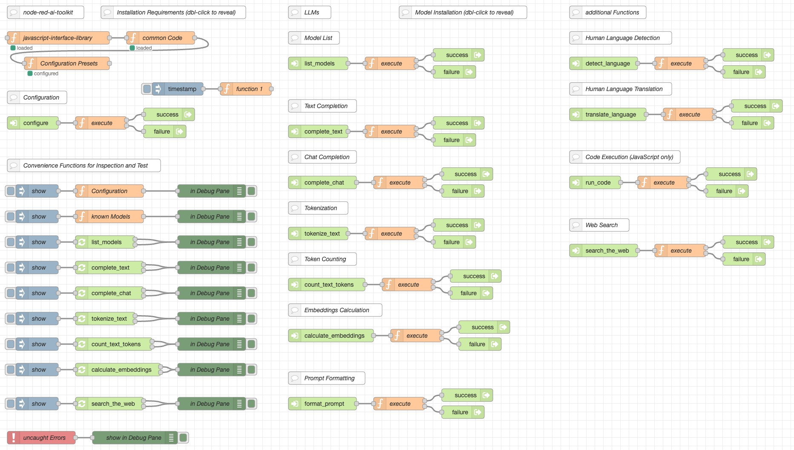

# node-red-ai-toolkit

a collection of Node-RED nodes and flows for interactive low-code development of
applications using AI technologies - free of charge and even for beginners or 
casual programmers

[](https://www.youtube.com/watch?v=f86t-BBy_rY)<br>(click the image to see a short preview video)

> **Important**: this toolkit is currently being developed very actively - so far, it has only been tested on Mac Silicon under macOS 13.6 (Ventura). Please be patient until around midth of January 2024 when a stable version should be released - expect many updates until then, some may even introduce breaking changes

Next steps:

- Version Management: check for toolkit and model updates programmatically
- Model Catalog: choose from a set of already tested, automatically downloadable AI models with optimized model-specific prompts for the various use cases this toolkit covers - or add your own models
- Tool Store: enhance your AI agents with additional "tools". Use tools that come with this toolkit or add your own
- Recipe Store: direct your AI agents with "recipes" that tell it how to solve well-known problems (rather than deciding on its own) to make it more robust. Use recipes that come with this toolkit or add your own
- Key-Value and Vector Stores: add your own extensible knowledge database and let your AI agent scan that first before searching the web
- support for Windows and Linux
- simplified installation: right now, installation requires many steps snd is far from being simple. As soon as the toolkit has some degree of function completeness, the idea is to provide an "installer" which guides users through that process

> Just a small note: if you like this module and plan to use it, consider "starring" this repository (you will find the "Star" button on the top right of this page), so that I know which of my repositories to take most care of.

## Examples ##

Right now, there are three small examples which demonstrate the power of this toolkit and illustrate the usage of its nodes:

* [Node-RED AI Playground](https://github.com/rozek/node-red-ai-playground) - a simple "playground" that let's you experiment with a language model
* [Node-RED AI Chatbot](https://github.com/rozek/node-red-ai-chatbot) - a simple chatbot
* [Node-RED AI Web Search](https://github.com/rozek/node-red-ai-web-search) - a simple "AI-assisted Web Search" which searches the web and analyzes any search results in order to answer a given request (not from the language model's internal knowledge but from external resources)
* ("Chain-of-Thought" example pending)
* ("Tree-of-Thought" example pending)

## Installation ##

This section shows you how to install Node.js, Node-RED, LLaMA.cpp, GGML and the flows from this repository - feel free to skip the steps for those components you already installed before.

### Node.js ###

"_[Node.js](https://nodejs.org/en) is a cross-platform, open-source server environment that can run on Windows, Linux, Unix, macOS, and more. Node.js is a back-end JavaScript runtime environment, runs on the V8 JavaScript engine, and executes JavaScript code outside a web browser._" (according to [Wikipedia](https://en.wikipedia.org/wiki/Node.js))

Start by [installing Node.js](https://nodejs.org/en) as described on their web page.

### Node-RED ###

"_[Node-RED](https://nodered.org/) is a flow-based, low-code development tool for visual programming developed originally by IBM..._" (according to [Wikipedia](https://en.wikipedia.org/wiki/Node-RED)).

If not already done, install Node-RED as described on their "[Get Started](https://nodered.org/#get-started)" page.

### LLaMA.cpp ###

[LLaMA.cpp](https://github.com/ggerganov/llama.cpp) is a port of Facebook's LLaMA model in C/C++ (don't be fooled by the statement that the "_main goal of llama.cpp is to run the LLaMA model using 4-bit integer quantization on a MacBook_" - LLaMA.cpp runs just as well under Windows and Linux, and with different quantizations)

> Note: **please use my own fork of the original LLaMA.cpp** as the code in there raises the context limit, contains additional functions for tokenization and does not echo a given prompt back to stdout.

Get the code as follows:

```
git https://github.com/rozek/llama.cpp
cd llama.cpp
```

Then continue as described in the [LLaMA.cpp docs](https://github.com/rozek/llama.cpp#build)

Afterwards, rename the executables

* `main` to `llama`,
* `tokenization` to `llama-tokens` and
* `embedding` to `llama-embeddings`

and copy them into the Node-RED "User Directory" (by default, this folder is located at `$HOME/.node-red`).

### GGML ###

[GGML](https://github.com/ggerganov/ggml) is a "Tensor library for machine learning" written in C

From all of the examples in that project, we only need GPT-NeoX. Install it as described in its [README](https://github.com/ggerganov/ggml/tree/master/examples/gpt-neox) file, but skip the conversion step - we will later download an already converted model instead:

```
git clone https://github.com/ggerganov/ggml
cd ggml
mkdir build && cd build
cmake ..
make -j
```

Afterwards, copy the executable `./bin/gpt-neox` into the Node-RED "User Directory" (by default, this folder is located at `$HOME/.node-red`).

### UIBuilder ###

While the Node-RED AI Toolkit itself does not need any UI frontend, there are a few examples for the toolkit which do. For that reason, it may be a good idea to [install the UIBuilder nodes as described in their documentation](https://totallyinformation.github.io/node-red-contrib-uibuilder/#/walkthrough1?id=how-to-get-started-4-steps-to-a-data-driven-web-app).

### Language Models ###

You should now choose one or multiple language models and download them as described in their repositories (you _may_ also import the flows for the chosen LLMs, but don't have to):

* [Dans-TotSirocco-7B](https://github.com/rozek/node-red-flow-dans-totsirocco-7b)
* [StableLM-3B-4E1T](https://github.com/rozek/node-red-flow-stablelm-3b-4e1t)
* [StableCode-Completion-Alpha-3B-4K](https://github.com/rozek/node-red-flow-stablecode-completion-alpha-3b-4k)

In principle, any LLaMA.cpp compatible model should work, a nice choice could also be

* [42dot_LLM-SFT-1.3B](https://huggingface.co/rozek/42dot_LLM-SFT-1.3B_GGUF) (use the Q8_0 quantization)

### Toolkit Flows ###

Finally import the contents of file [AI-Toolkit-Flows.json](https://raw.githubusercontent.com/rozek/node-red-ai-toolkit/master/AI-Toolkit-Flows.json) into a new worksheet.

After deployment, you may change the internals of the "configure" flow, redeploy and use any of the "Convenience Functions for Inspection and Test" to play with the already existing nodes.


t.b.c.

## Reference Manual ##

The AI Toolkit consists of two major parts:

* a set of internal JavaScript methods and
* a set of Node-RED nodes built on top of these methods.

If you just want to use the existing nodes, you may safely ignore the first part. However, the internal methods will become handy as soon as you plan to implement your own (function) nodes which interact with those from the toolkit.

### Internal Methods ###

The internal methods of the AI Toolkit were implemented as static methods of a JavaScript class and then stored in the global Node-RED context. Typically, you get access to these methods as follows:

```javascript
const {
  acceptableString, OptionsFrom, CompletionOfText
} = global.get('AI-Toolkit-commonCode')
```

Many of these methods (albeit not all) run asynchronously. As a consequence, within your own Node-RED function node, you should write asynchronous code in a manner similar to

```javascript
const { ... } = global.get('AI-Toolkit-commonCode')

;(async function () {
  ... insert your asynchronous code here - don't forget "await"
})()
```

If you decide to mimic the design of most Toolkit nodes and provide two outputs (one for successful runs and one for failures), you may add the following `try-catch` statement

```javascript
const { ... } = global.get('AI-Toolkit-commonCode')

;(async function () {
  try {
    ... insert your asynchronous code here - don't forget "await"

    node.send([msg,null]) // for a successful run
    node.done()
  } catch (Signal) {
    msg.statusCode = Signal.StatusCode || 500
    msg.payload    = Signal.message    || ''

    node.send([null,msg]) // for failures
    node.done()
  }
})()
```

Finally, it may be helpful for demonstrations and error tracking to change a node's status while running:

```javascript
const { ... } = global.get('AI-Toolkit-commonCode')

;(async function () {
  node.status({ fill: 'yellow', shape: 'ring', text: 'running' })
  try {
    ... insert your asynchronous code here - don't forget "await"

    node.status({ fill: 'green', shape: 'dot', text: 'finished' })

    node.send([msg,null]) // for a successful run
    node.done()
  } catch (Signal) {
    msg.statusCode = Signal.StatusCode || 500
    msg.payload    = Signal.message    || ''

    node.status({ fill: 'red', shape: 'dot', text: 'ExitCode = ' + (Signal.StatusCode || 'unknown') })

    node.send([null,msg]) // for failures
    node.done()
  }
})()
```


## Nodes and Interfaces ##

The toolkit currently consists of the following nodes:

* **[configure_toolkit](https://github.com/rozek/node-red-ai-toolkit#configure_toolkit)** - configures the toolkit and its nodes
* **[list_configuration](https://github.com/rozek/node-red-ai-toolkit#list_configuration)** - reveals the current toolkit configuration
<br>&nbsp;<br>
* **[check_for_toolkit_updates](https://github.com/rozek/node-red-ai-toolkit#check_for_toolkit_updates)** - checks for updates of this toolkit
* **[check_for_model_updates](https://github.com/rozek/node-red-ai-toolkit#check_for_model_updates)** - checks for updates for the set of known AI models
<br>&nbsp;<br>
* **[update_known_models](https://github.com/rozek/node-red-ai-toolkit#update_known_models)** - updates the set of known AI models
* **[list_known_models](https://github.com/rozek/node-red-ai-toolkit#list_known_models)** - lists all known models and their details
* **[list_available_models](https://github.com/rozek/node-red-ai-toolkit#list_available_models)** - lists all already downloaded models
* **[list_pending_models](https://github.com/rozek/node-red-ai-toolkit#list_pending_models)** - lists all models currently being downloaded
* **[learn_model](https://github.com/rozek/node-red-ai-toolkit#learn_model)** - adds a given model to the set of known ones (or overwrites an existing one)
* **[unlearn_model](https://github.com/rozek/node-red-ai-toolkit#unlearn_model)** - removes a given model from the set of known ones
<br>&nbsp;<br>
* **[download_file](https://github.com/rozek/node-red-ai-toolkit#download_file)** - downloads a given file (and sends progress reports)
* **[cancel_download](https://github.com/rozek/node-red-ai-toolkit#cancel_download)** - cancels an ongoing download
<br>&nbsp;<br>
* **[format_prompt](https://github.com/rozek/node-red-ai-toolkit#format_prompt)** - formats a prompt for a given model from a given list of messages
<br>&nbsp;<br>
* **[complete_text](https://github.com/rozek/node-red-ai-toolkit#complete_text)** - performs a text completion
* **[complete_chat](https://github.com/rozek/node-red-ai-toolkit#complete_chat)** - performs a message list completion
* **[tokenize_text](https://github.com/rozek/node-red-ai-toolkit#tokenize_text)** - tokenizes a given text
* **[calculate_embedding](https://github.com/rozek/node-red-ai-toolkit#calculate_embedding)** - calculates the embedding vector for a given text
<br>&nbsp;<br>
* **[split_text](https://github.com/rozek/node-red-ai-toolkit#split_text)** - splits a long text into chunks suitable for a given model
* **[assemble_text](https://github.com/rozek/node-red-ai-toolkit#assemble_text)** - reassembles a split text (e.g., after chunk-wise processing)
<br>&nbsp;<br>
* **[summarize_text](https://github.com/rozek/node-red-ai-toolkit#summarize_text)** - summarizes a given text
<br>&nbsp;<br>
* **[\[try_to_\]extract_search_string_from_text](https://github.com/rozek/node-red-ai-toolkit#try_to_extract_search_string_from_text)** - constructs a search engine prompt from a given text
* **[\[try_to_\]extract_decision_from_text](https://github.com/rozek/node-red-ai-toolkit#try_to_extract_decision_from_text)** - runs a "text completion" with the possible results `yes` or `no` (or `unknown`)
* **[\[try_to_\]extract_list_from_text](https://github.com/rozek/node-red-ai-toolkit#try_to_extract_list_from_text)** - runs a "text completion" and returns a newline-separated list of strings
* **[\[try_to_\]extract_json_list_from_text](https://github.com/rozek/node-red-ai-toolkit#try_to_extract_json_list_from_text)** - runs a "text completion" and returns a list of JavaScript strings in JSON format
* **[\[try_to_\]extract_response_from_text](https://github.com/rozek/node-red-ai-toolkit#try_to_extract_response_from_text)** - runs a "text completion" with a request that is applied to a given text
<br>&nbsp;<br>
* **[detect_language](https://github.com/rozek/node-red-ai-toolkit#detect_language)** - tries to detect the language of a given text
* **[translate_language](https://github.com/rozek/node-red-ai-toolkit#translate_language)** - translates a given text from one language into another
<br>&nbsp;<br>
* **[generate_function](https://github.com/rozek/node-red-ai-toolkit#generate_function)** - generates a (JavaScript) function
* **[evaluate_function](https://github.com/rozek/node-red-ai-toolkit#evaluate_function)** - runs a given (JavaScript) function in a sandbox
<br>&nbsp;<br>
* **[load_key_store](https://github.com/rozek/node-red-ai-toolkit#load_key_store)** - reads a complete key-value store collection from the file system
* **[patch_key_store](https://github.com/rozek/node-red-ai-toolkit#patch_key_store)** - writes a given key-value store collection entry to the file system
* **[save_key_store](https://github.com/rozek/node-red-ai-toolkit#save_key_store)** - writes a complete key-value store collection to the file system
* **[list_in_key_store](https://github.com/rozek/node-red-ai-toolkit#list_in_key_store)** - lists all collections (or the keys of a given collection) in the key-value store
* **[get_from_key_store](https://github.com/rozek/node-red-ai-toolkit#get_from_key_store)** - reads a given collection entry from the key-value store
* **[put_to_key_store](https://github.com/rozek/node-red-ai-toolkit#put_to_key_store)** - writes a given collection entry to the key-value store
* **[find_in_key_store](https://github.com/rozek/node-red-ai-toolkit#find_in_key_store)** - performs a full-text search over a given collection in the key-value store
* **[remove_from_key_store](https://github.com/rozek/node-red-ai-toolkit#remove_from_key_store)** - removes a given collection entry (or a whole collection) from the key-value store
<br>&nbsp;<br>
* **[load_vector_store](https://github.com/rozek/node-red-ai-toolkit#load_vector_store)** - reads a complete vector store collection from the file system
* **[patch_vector_store](https://github.com/rozek/node-red-ai-toolkit#patch_vector_store)** - writes a given vector store collection entry to the file system
* **[save_vector_store](https://github.com/rozek/node-red-ai-toolkit#save_vector_store)** - writes a complete vector store collection to the file system
* **[list_in_vector_store](https://github.com/rozek/node-red-ai-toolkit#list_in_vector_store)** - lists all collections (or the keys of a given collection) in the vector store
* **[get_from_vector_store](https://github.com/rozek/node-red-ai-toolkit#get_from_vector_store)** - reads a given collection entry from the vector store
* **[put_to_vector_store](https://github.com/rozek/node-red-ai-toolkit#put_to_vector_store)** - writes a given collection entry to the vector store
* **[find_in_vector_store](https://github.com/rozek/node-red-ai-toolkit#find_in_vector_store)** - performs a full-text search over a given collection in the vector store
* **[locate_in_vector_store](https://github.com/rozek/node-red-ai-toolkit#locate_in_vector_store)** - uses "cosine similarity" to locate one or multiple entries close to a given embedding vector in the vector store
* **[remove_from_vector_store](https://github.com/rozek/node-red-ai-toolkit#remove_from_vector_store)** - removes a given collection entry (or a whole collection) from the vector store
<br>&nbsp;<br>
* **[send_ui_reset](https://github.com/rozek/node-red-ai-toolkit#send_ui_reset)** - sends a "reset" request (opt. providing explicit default settings) to the UI
* **[send_ui_state](https://github.com/rozek/node-red-ai-toolkit#send_ui_state)** - sends an application-specific state to the UI
* **[send_ui_data](https://github.com/rozek/node-red-ai-toolkit#send_ui_data)** - sends application-specific data to the UI
* **[send_ui_known_model_list](https://github.com/rozek/node-red-ai-toolkit#send_ui_known_model_list)** - sends a list of all currently known models to the UI
* **[send_ui_available_model_list](https://github.com/rozek/node-red-ai-toolkit#send_ui_available_model_list)** - sends a list of all currently available models to the UI
* **[send_ui_download_progress](https://github.com/rozek/node-red-ai-toolkit#send_ui_download_progress)** - sends a progress report for a given file download
* **[send_ui_notice](https://github.com/rozek/node-red-ai-toolkit#send_ui_notice)** - sends a "notice" to the UI (which may be shown as a "toast" or within a notice bar)
* **[send_ui_message_list](https://github.com/rozek/node-red-ai-toolkit#send_ui_message_list)** - sends a complete list of messages to the UI
* **[send_ui_progress](https://github.com/rozek/node-red-ai-toolkit#send_ui_progress)** - sends a (text or chat) completion progress report to the UI
* **[send_ui_data_request](https://github.com/rozek/node-red-ai-toolkit#send_ui_data_request)** - sends a request for additional input data to the UI
* **[send_ui_response](https://github.com/rozek/node-red-ai-toolkit#send_ui_response)** - sends the final output of a (text or chat) completion to the UI
<br>&nbsp;<br>
* **[process_ui_model_choice](https://github.com/rozek/node-red-ai-toolkit#process_ui_model_choice)** - processes an incoming model choice from the UI
* **[process_ui_download_continuation](https://github.com/rozek/node-red-ai-toolkit#process_ui_download_continuation)** - processes an incoming file download continuation request from the UI
* **[process_ui_download_cancellation](https://github.com/rozek/node-red-ai-toolkit#process_ui_download_cancellation)** - processes an incoming file download cancellation request from the UI
* **[process_ui_data_response](https://github.com/rozek/node-red-ai-toolkit#process_ui_data_response)** - processes an incoming reponse to a previously sent enquiry for additional information
* **[process_ui_request](https://github.com/rozek/node-red-ai-toolkit#process_ui_request)** - processes an incoming (text or chat) completion  request from the UI
* **[process_ui_cancellation](https://github.com/rozek/node-red-ai-toolkit#process_ui_cancellation)** - processes an incoming completion cancellation request from the UI

## Configuration- and Resource-related Nodes ##

### configure_toolkit ###

This node can be used to configure the Node-RED AI Toolkit according to your specific needs. Usually, it is invoked upon node deployment (or at server startup) and then never used again

(t.b.w.)

### list_configuration ###

returns a set of all configuration settings

(t.b.w.)

### check_for_toolkit_updates ###

starts a REST request against this repository to check whether there is a new version of this toolkit. Right now, there is no possibility to automatically update the nodes in a flow from within Node-RED - thus, your application should just display a notice and let the user replace the existing toolkit flow with a new one when necessary.

**relevant `msg` Properties on Input**

* (none)

**relevant `msg` Properties on Output**

* **`msg.ToolkitVersion`** - contains the most recently released version of this Toolkit

This node has three outputs

1. one for a successful operation where the toolkit seems to be up-to-date
2. one for an operation failure and
3. one for a successful operation where the toolkit seems to be outdated

### check_for_model_updates ###

starts a REST request against this repository to check whether there is a new version of the "official" 
list of "known" AI models. If so, you may use the node `update_known_models` to download the new list and store it locally in your configured `ModelFolder`.

**relevant `msg` Properties on Input**

* (none)

**relevant `msg` Properties on Output**

* **`msg.ModelSetVersion`** - contains the most recently released version of the set of known AI models

This node has three outputs

1. one for a successful operation where the internal model set seems to be up-to-date
2. one for an operation failure and
3. one for a successful operation where the internal model set seems to be outdated

### update_known_models ###

starts a REST request against this repository to download the current list of "officially known" AI models and store it locally in your configured `ModelFolder`.

(t.b.w.)

### list_known_models ###

constructs a list of all currently "known" AI models (including official ones from this repository and locally taught models) and their characteristics (such as the program required for text completion, the recommended prompt structure and the maximal context length).

(t.b.w.)

### list_available_models ###

constructs a list of all currently installed AI models (together with their characteristics as stored in the model set).

(t.b.w.)

### list_pending_models ###

constructs a list of all AI models which are currently being downloaded (together with their download progress).

(t.b.w.)

### learn_model ###

adds a given model to the local set of "known" AI models. You may either add a new model or change the characteristics of an already existing one.

(t.b.w.)

### unlearn_model ###

removes a given model to the local set of "known" AI models. You may remove locally "taught" models as well as "officially known" ones. It is safe to remove a non-existent model.

(t.b.w.)

### download_file ###

starts downloading a file from a given URL into a gien target folder. It is forbidden to download a file which is already being downloaded - unless the download was interrupted for any reason (such as a server or network failure) in which case the toolkit tries to resume the download (or, if that is not supported by the server, to restart it)

(t.b.w.)

### cancel_download ###

cancels an ongoing file download and removes what has been downloaded before. Cancelling an already completed download is forbidden

(t.b.w.)

## AI-related Nodes ##

The following nodes are directly related to AI models and their usage

### format_prompt ###

takes a list of (properly constructed) messages and creates a "prompt" for a given AI model. This prompt may then by sent to a `complete_text` node.

(t.b.w.)

### complete_text ###

takes a given text prompt and runs a text completion using a given model with given settings.

(t.b.w.)

### complete_chat ###

takes a list of (properly constructed) messages, converts them into a prompt and runs a text completion using a given model with given settings. Basically, this node is just a concatenation of `format_prompt` and `complete_text`.

(t.b.w.)

### tokenize_text ###

tokenizes a given text using a given model, producing a list of tokens given by their internal code and the corresponding (sequence of) characters.

(t.b.w.)

### calculate_embedding ###

calculates the embedding vector for a given text using a given model. This vector may then be used, e.g., as an index of some content in a vector database which may then be found by a "similarity search".

(t.b.w.)

### split_text ###

takes a given text and tries to split it into "chunks" (short enough to be processed by a given AI model) in an "intelligent" way, i.e., without splitting paragraphs, sentences or words. This split requires the given text to be "tokenized" unless the list of tokens for the given text exists already.

(t.b.w.)

### assemble_text ###

takes a given list of chunks and joins them into a single text. If all chunks were provided with their associated token lists, the resulting text will have an associated token list as well.

(t.b.w.)

### summarize_text ###

tries to summarize a given text. if this text is too long to be summarized in a single run, it will be split into chunks, summarized chunk by chunk and these summaries then by re-assembled into the final result. Depending on the size of the original text (compared to the context length of AI model used), several such rounds may be necessary before a response can be issued

(t.b.w.)

### [try_to_]extract_search_string_from_text ###

tries to construct one or several search engine prompts from a given text

(t.b.w.)

### [try_to_]extract_decision_from_text ###

tries to apply a given prompt to a given text returning either `yes` or `no` only (if `extract_decision_from_text` is used) or one of `yes`, `no` or `unknown` (if `try_to_extract_decision_from_text` is used). Please note, that the given prompt must tell the used AI model to only respond with one of the permitted keywords - this node then asserts the proper output.

(t.b.w.)

### [try_to_]extract_list_from_text ###

tries to apply a given prompt to a given text returning a newline-separated list of strings (with no inner newlines, of course). Please note, that the given prompt must tell the used AI model to only respond with such a list - this node then asserts the proper output.

(t.b.w.)

### [try_to_]extract_json_list_from_text ###

tries to apply a given prompt to a given text returning a JSON-formatted list of JavaScript strings. Please note, that the given prompt must tell the used AI model to only respond with such a list - this node then asserts the proper output.

(t.b.w.)

### [try_to_]extract_response_from_text ###

tries to apply a given prompt to a given text with the objective to extract the desired information from that text.

(t.b.w.)

## Nodes for Additional Functionalities ##

The following nodes provide additional, often required functions

### detect_language ###

Takes a given text and tries to detect the language it is written in.

(t.b.w.)

### translate_language ###

Takes a given text and translates it from one language into another one.

(t.b.w.)

### generate_function ###

takes a given text and generates the body of an asynchronous JavaScript function based on what the text requests (using a code-generating AI model). Please note, that the given prompt must tell the used AI model to generate such a function body - this node then asserts the proper output.

(t.b.w.)

### evaluate_function ###

takes a given JavaScript function and (asynchronously) evaluates it within a sandbox. The given function must not require any arguments but may return any value which is then used as the output of this node. Any thrown exceptions are caught and passed using a different output pin. If desired, a timeout value may be given that aborts the function after a while.

(t.b.w.)

## Nodes for the Key-Value Store ##

The following nodes may be used to access the built-in Key-Value Store. That store is organized into separate independent "collections" with "entries" addressed by literal "keys". Any entry has the following structure:

* **`Collection`** - the name of the collection this entry is part of
* **`Key`** - the literal key this entry is stored under
* **`Value`** - the primary content of this entry
* **`Info`** - an optional JavaScript object with additional (usually application-specific) meta data for this entry

### load_key_store ###

loads a given key-value store collection as a whole from the file system.

(t.b.w.)

### patch_key_store ###

writes a single key-value store collection entry onto the file system.

(t.b.w.)

### save_key_store ###

writes a given key-value store collection as a whole onto the file system.

(t.b.w.)

### list_in_key_store ###

lists either the names of all key-value store collections or the keys of all entries of a given key-value store collection.

(t.b.w.)

### get_from_key_store ###

reads a single entry from a given key-value store collection.

(t.b.w.)

### put_to_key_store ###

writes a single entry into a given key-value store collection (overwriting any previous contents).

(t.b.w.)

### find_in_key_store ###

performs a simple full-text search over all entries of a given key-value store collection and returns the keys of the first 1...n (or all) matching entries.

(t.b.w.)

### remove_from_key_store ###

removes either a single entry from a given key-value store collection or a whole key-value store collection.

(t.b.w.)

## nodes for the Vector Store ##

The following nodes can be used to access the built-in Vector Store. That store resembles very much the "Key-Value Store" mentioned before, but additionally supports a "similarity search" using embedding vectors calculated by an AI model (nota bene: for compatibility reasons, all vectors should be calculated using the same AI model)

The vector store is organized into separate independent "collections" with "entries" addressed by literal "keys". Any entry has the following structure:

* **`Collection`** - the name of the collection this entry is part of
* **`Embedding`** - an embedding vector associated with this entry. Usually, the `Embedding` is calculated either from the `Key` or the `Value` of an entry. If missing, the `Embedding` is derived from the given `Key`
* **`Key`** - the literal key this entry is stored under. If missing, the `Value` is also used as a key
* **`Value`** - the primary content of this entry
* **`Info`** - an optional JavaScript object with additional (usually application-specific) meta data for this entry

### load_vector_store ###

loads a given vector store collection as a whole from the file system.

(t.b.w.)

### patch_vector_store ###

writes a single vector store collection entry onto the file system.

(t.b.w.)

### save_vector_store ###

writes a given vector store collection as a whole onto the file system.

(t.b.w.)

### list_in_vector_store ###

lists either the names of all vector store collections or the keys of all entries of a given vector store collection.

(t.b.w.)

### get_from_vector_store ###

reads a single entry from a given vector store collection.

(t.b.w.)

### put_to_vector_store ###

writes a single entry into a given vector store collection (overwriting any previous contents).

(t.b.w.)

### find_in_vector_store ###

performs a simple full-text search over all entries of a given vector store collection and returns the keys of the first 1...n (or all) matching entries.

(t.b.w.)

### locate_in_vector_store ###

performs a "similarity search" based on the "cosine similarity" between (the embedding vector of) each entry of a given vector collection and (the embedding vector of) a given search text and returns (0),1...n matching entries sorted by descending similarity. If desired, a similarity threshold may be specified to consider really similar entries only

(t.b.w.)

### remove_from_vector_store ###

removes either a single entry from a given vector store collection or a whole vector store collection.

(t.b.w.)

## Nodes for the UI ##

This toolkit directly supports web-based user interfaces created with the [Node-RED UIBuilder](https://github.com/TotallyInformation/node-red-contrib-uibuilder). The following nodes can be used to interact with such a user interface

### send_ui_reset ###

sends a "Reset" request to the attached UI, optionally along with explicit default settings. It is up to the UI to ignore this message or react properly.

(t.b.w.)

### send_ui_state ###

sends an application-specific "state" object to the attached UI. It is up to the UI to ignore this message or react properly.

(t.b.w.)

### send_ui_data ###

sends an application-specific "data" object to the attached UI. It is up to the UI to ignore this message or react properly.

(t.b.w.)

### send_ui_known_model_list ###

sends a list of all _known_ AI models (and their characteristics) to the attached UI. It is up to the UI to ignore this message or react properly.

(t.b.w.)

### send_ui_available_model_list ###

sends a list of all actually _available_ AI models (and their characteristics) to the attached UI. It is up to the UI to ignore this message or react properly.

(t.b.w.)

### send_ui_download_progress ###

sends a "download progress" message for a given URL to the attached UI. It is up to the UI to ignore this message or react properly.

(t.b.w.)

### send_ui_notice ###

sends a "notice" message of a given type (either `error`, `warning` or `info`) to the attached UI. It is up to the UI to ignore this message or react properly.

(t.b.w.)

### send_ui_message_list ###

sends a complete (chat) message list to the attached UI. It is up to the UI to ignore this message or react properly.

(t.b.w.)

### send_ui_progress ###

sends an "action progress" message to the attached UI. It is up to the UI to ignore this message or react properly.

(t.b.w.)

### send_ui_data_request ###

sends a "data request" message to the attached UI by which an action requests additional input from the user. The UI should handle this message (usually by displaying the request and waiting for the user to enter some text) and send the user input back (see below).

(t.b.w.)

### send_ui_response ###

sends the ultimate response of an action to the attached UI. The UI should append this response in its internal (chat) message list or update a previous version of that response.

(t.b.w.)

### process_ui_model_choice ###

processes an incoming "model choice" message from the attached UI containing the AI model the user has chosen.

(t.b.w.)

### process_ui_download_continuation ###

processes an incoming "download continuation" message from the attached UI for a given URL asking the toolkit to start or continue a download from that URL.

(t.b.w.)

### process_ui_download_cancellation ###

processes an incoming "download cancellation" message from the attached UI for a given URL asking the toolkit to cancel a download from that URL.

(t.b.w.)

### process_ui_data_response ###

processes an incoming "data response" message from the attached UI containing the user's response to a previously issued "data request" message (see above).

(t.b.w.)

### process_ui_request ###

processes an incoming "action request" message from the attached UI asking the toolkit to perform a given operation (such as a text completion).

(t.b.w.)

### process_ui_cancellation ###

processes an incoming "action cancellation" message from the attached UI asking the toolkit to cancel a given operation.

(t.b.w.)

## Configuration Specification ##

A "toolkit configuration" is a JavaScript object with the following properties

* (t.b.w.)

## AI Model Specification ##

A "known AI model" is a model for which a JavaScript object with its most important characteristics exists. The specifications of some recommended models are already part of this toolkit, but you may equally well download other model files (provided that they are compatible with the existing executables) and add a proper specification for them yourself

A proper model specification contains the following properties

* **`Model`** - mandatorially specifies the name of a model
* **`ModelURL`** - optionally contains a URL for the model description (such as a Hugging Face "model card") 
* **`Creator`** - optionally contains the name of the model creator
* **`CreatorURL`** - optionally contains a URL for the model creator's web site
* **`DocumentationURL`** - optionally contains a URL with additional documentation (such as a technical report) for the model
* **`Architecture`** - mandatorially specifies the underlying model architecture (such as `llama`, `stablelm`, `gptneox` or `rwkv`, which is important for the toolkit to chose the correct executable for the model)
* **`Purposes`** - optionally contains a list (i.e., a JavaScript array) with one or multiple foreseen use cases of this model (see below for details)
* **`Languages`** - optionally contains a list (i.e., a JavaScript array) of the (spoken and programming) languages the model supports
* **`Benchmarks`** - optionally contains a set (i.e., JavaScript object) with the model's benchmark results as published in the Hugging Face [Open LLM Leaderboard](https://huggingface.co/spaces/HuggingFaceH4/open_llm_leaderboard) (see below for details)
* **`Quantizations`** - mandatorially contains a set of quantizations for this model (see below for details)
* **`Templates`** - mandatorially contains a set of templates which are used to convert a list of messages into a model prompt (see below for details)
* **`ContextLimit`** - mandatorially contains the max. number of tokens this model supports
* **`ReversePrompts`** - optionally contains a list (i.e., a JavaScript array) with up to four strings that may be used as "reverse prompts" for llama.cpp
* **`License`** - optionally contains the name of the model license
* **`LicenseURL`** - optionally contains the URL of a document that describes the model license in its detail

The following use cases are supported by this toolkit:

* **`text`** - the model can be used to generate general text
* **`code`** - the model can be used to generate program source code
* **`embeddings`** - the model can be used to calculate an embedding vector

The `Benchmarks` characteristic is a JavaScript object whose properties have the name of one of the benchmarks used in the Hugging Face [Open LLM Leaderboard](https://huggingface.co/spaces/HuggingFaceH4/open_llm_leaderboard) and the result of the related benchmark as their value. Currently, the Leaderboard considers the following benchmarks

* **`Average`** - not a benchmark by itself but the average rating of all other ones
* **`ARC`** - [AI2 Reasoning Challenge](https://arxiv.org/abs/1803.05457) (25-shot) - a set of grade-school science questions
* **`HellaSwag`** - [HellaSwag](https://arxiv.org/abs/1905.07830) (10-shot) - a test of commonsense inference, which is easy for humans (~95%) but challenging for SOTA models
* **`MMLU`** - [MMLU](https://arxiv.org/abs/2009.03300) (5-shot) - a test to measure a text model's multitask accuracy. The test covers 57 tasks including elementary mathematics, US history, computer science, law, and more
* **`TruthfulQA`** - [TruthfulQA](https://arxiv.org/abs/2109.07958) (0-shot) - a test to measure a model's propensity to reproduce falsehoods commonly found online
* **`Winogrande`** - [Winogrande](https://arxiv.org/abs/1907.10641) (5-shot) - an adversarial and difficult Winograd benchmark at scale, for commonsense reasoning
* **`GSM8K`** - [GSM8k](https://arxiv.org/abs/2110.14168) (5-shot) - diverse grade school math word problems to measure a model's ability to solve multi-step mathematical reasoning problems

The descriptions were directly taken from the Leaderboard's "About" page

The `Quantizations` characteristic is a JavaScript object whose properties are named by an available quantization (such as `q8_0`, `q5_k_m`, or similar, always given in lowercase) and contain a quantization specification object with the following properties:

* **`Quantization`** - mandatorially contains the described quantization (which is also used as the key for this object)
* **`FileURL`** - mandatorially contains the URL where the described quantization may be downloaded
* **`FileSize`** - optionally contains the size of the file to be downloaded. Please note: an interrupted file download may only be recognized as such (and then be resumed) if the file size is given and exact
* **`RAM`** - optionally contains the amount of RAM needed to run a text inference with a context size of 512
* **`Speed`** - optionally contains the time needed to generate an output token running a text inference with a context size of 512
* **`Perplexity`** - optionally contains the "perplexity" of the given quantization (in order to be able to decide which quantization to use)

The `Templates` characteristic is a JavaScript object with the following properties:

* **`Prefix`** - contains the recommended prompt prefix for models which do not support "system" messages
* **`System`** - contains the template for a "system" message with `${Content}` as the placeholder for the actual content of that message
* **`User`** - contains the template for a "user" message with `${Content}` as the placeholder for the actual content of that message
* **`Assistant`** - contains the template for a (complete) "assistant" message with `${Content}` as the placeholder for the actual content of that message
* **`Suffix`** - contains the recommended prompt suffix to trigger a proper text completion (normally, this is just an incomplete "assistant" message)


----

(old contents start here)


> Do you also use Bing Chat all the time? And marvel at the possibilities of the OpenAI GPTs?
> 
> What if you could run a similar system completely on your own computer - changeable and expandable according to your own wishes? Without disclosing data to third parties and without having to fear horrendous bills? And if you also want to hardware sensors, control devices or integrate any other functions? And without (or at least only a little) having to program?
> 
> The node-red-ai-toolkit provides you with all the necessary components to build your own private personal AI assistant in the no-code/low-code environment Node-RED - fully open-source and completely free of charge!



Build your own

* Chatbot,
* autonomous Agent or
* any other AI-related application

with specific functionalities according to your wishes - completely without any coding (or very little one, at least).

If you don't have any programming experience, you may even decide to use "Blockly", i.e., to combine activity-specific parts in a LEGO-like manner (the result is then automatically converted to JavaScript, which means that you won't experience any performance loss)

For text-based applications, use existing GPT and/or RWKV models or train or fine-tune your own ones. For image-based applications, use LinerAI for training and import the resulting models into your Node-RED workspace.

Run the chosen AI models either locally or use an AI service provider over the internet.

### Why should you care? ###

This project is for you if you

* want to experiment with AI technologies or
* have an idea for an applications based on AI (or using AI functionalities)

but

* only have moderate knowledge of programming (or just limited time) and/or
* don't want to spend money or want your data to leave your machine.

> this repository should currently be considered as "work-in-progress" and is the author's contribution to the [Backdrop Build](https://backdropbuild.com/) contest. Please see this as kind of a "preview": since I'm currently in hospital because of a cancer surgery, I have to pause for a week but will continue developing from Dec, 11th on.

> Just a small note: if you like this work and plan to use it, consider "starring" this repository (you will find the "Star" button on the top right of this page), so that I know which of my repositories to take most care of.

If you would like to support my work for Node-RED in the public domain, you may consider "[buying me a coffee](https://www.buymeacoffee.com/andreasrozek)"

## Overview ##

From [Wikipedia](https://en.wikipedia.org/wiki/Node-RED): "_Node-RED is a flow-based, low-code development tool for visual programming developed [...] for wiring together hardware devices, APIs and online services_" (nota bene: just as "hardware devices" are not required, the creation of "online services" is also not mandatory - Node-RED is pretty universal)

Based on Node-RED, the "node-red-ai-toolkit" is a collection of Node-RED nodes and flows that help building AI-based applications: just

* import the appropriate nodes and flows into a Node-RED workspace,
* configure them according to your needs,
* wire them together to form your application,

and you are done!

### It's Part of a free Ecosystem ###

Since real-world applications need more than just a few AI functions, the nodes from this toolkit fit seemlessly into a complete eco-system of further nodes, such as

* [node-red-http-endpoint-examples](https://github.com/rozek/node-red-http-endpoint-examples) - use these to learn how to create service "endpoints" which can be reached, e.g., over the internet
<br>&nbsp;<br>
* [node-red-authorization-examples](https://github.com/rozek/node-red-authorization-examples) - often, you want your users to authenticate themselves - these examples show you how to achieve this
* [node-red-rest-service-examples](https://github.com/rozek/node-red-rest-service-examples) - if you do not need a full-blown database, one of the "key-value-stores" from these examples may already be sufficient. And, if you plan to manage (i.e., upload, modify, delete) the files on your server from remote, the file management nodes from this repo may get you going
* [node-red-web-server-examples](https://github.com/rozek/node-red-web-server-examples) - most often, your AI services go along with a web-server which serves associated web pages, input forms or plain files. If you do not want to install a separate web server, you may just import one of these examples to add an open or closed web server
* [node-red-user-management-example](https://github.com/rozek/node-red-user-management-example) - managing users is hard, especially, if you have to keep **everything GDPR-compliant**. This set of nodes gives you everything you need, from user registration over email confirmation, user detail management, password reset up to the complete deletion of a user (if he/she wants so)
* [node-red-contact-form-examples](https://github.com/rozek/node-red-contact-form-examples) - two examples for (GDPR-compliant) contact forms (for arbitrary users) and feedback forms (for authenticated users)
* [node-red-flow-brave](https://github.com/rozek/node-red-flow-brave), [node-red-flow-startpage](https://github.com/rozek/node-red-flow-startpage) - flows which allow you to run internet searches and parse their findings
<br>&nbsp;<br>
* and, last not least: flows to tokenize prompts, calculate embeddings and run completions using any of the following free LLMs: [Meta AI LLaMA](https://github.com/rozek/node-red-flow-llama), [Stanford Alpaca (trained with GPT-3)](https://github.com/rozek/node-red-flow-alpaca), [Stanford Alpaca (trained with GPT-4)](https://github.com/rozek/node-red-flow-gpt4-x-alpaca), [Nomic AI GPT4All (filtered version)](https://github.com/rozek/node-red-flow-gpt4all-filtered), [Nomic AI GPT4All (unfiltered version)](https://github.com/rozek/node-red-flow-gpt4all-unfiltered), [Nomic AI GPT4All-J](https://github.com/rozek/node-red-flow-gpt4all-j), [Vicuna](https://github.com/rozek/node-red-flow-vicuna), [OpenLLaMA](https://github.com/rozek/node-red-flow-openllama) and [WizardLM](https://github.com/rozek/node-red-flow-wizardlm)

Beside those mentioned above, you may also add any other Node-RED node and/or flow to your application - just browse the [Node-RED Library](https://flows.nodered.org/) and choose whatever seems to fit best

### Deploy it on the Internet - for free ###

And, if you plan to publish your application for other people to use it, you may be interested in

* [node-red-on-always-free-vm](https://github.com/rozek/node-red-on-always-free-vm), a set of instructions how to install a Node-RED server on an Oracle "Always-Free" VM (a program that gives you two small machines reachable from the internet all around the clock (24/7) for free, without ads or other nag-ware)

For deployment, you may replace the web server from one of the above examples by another one based on Node.js with Express (which still allows you to modify its behaviour without too much effort). In that case, you may consider

* [node-red-within-express](https://github.com/rozek/node-red-within-express) - an HTTP(S) server with embedded Node-RED instance

## License ##

[MIT License](LICENSE.md)
